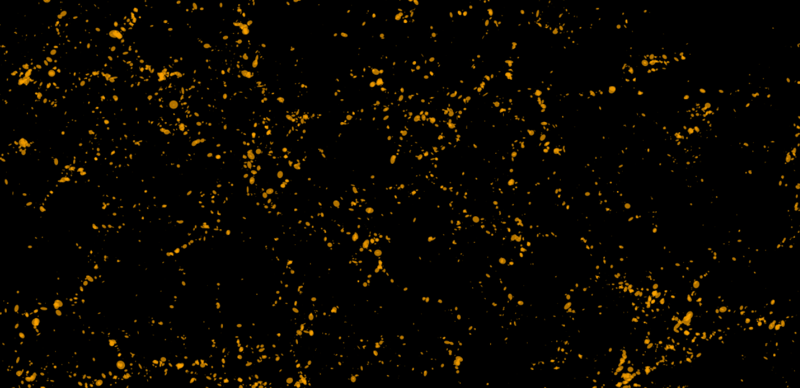

# genIAL

genIAL is a python code that generates intrinsic alignment (IA) of galaxies in cosmological simulations, taking into account the galaxy redshift, luminosity and color. The code is fully vectorized, allowing it to be run on large datasets using the Apache Spark framework.

The IA modeling is done in three steps:

- assigning 3D galaxy shapes
- assigning 3D galaxy orientations
- computing the observed 2D shapes and orientations

# reference
Details about the IA model are described in [Hoffmann et al. 2022](https://arxiv.org/abs/2206.14219).
Please cite this paper when using the code for your research.

# online example notebooks
- step-by-step tutorial, showing how to run genIAL on an input file from a cosmological simulation:

  https://colab.research.google.com/drive/1NUVA05EiyoGfrNyxVAS_2bZSOPVq5ngZ?usp=sharing

- running genIAL in a pipeline for different model settings and computing IA two-point statistics for each setting

  https://colab.research.google.com/drive/1C7pUOO8q5cNGpTBPMTzKLwE8InYLix3R?usp=sharing
  
- model galaxy 2D shapes for random 3D galaxy orientations
  
  https://colab.research.google.com/drive/1SN-X30pE6kW7NL_1yAE6s1NKcbfBVyCG?usp=sharing

# contact
Kai Hoffmann: kai (dot) d (dot) hoffmann (at) gmail (dot) com
